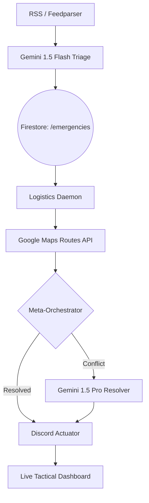

# Sentinel-Mind: Autonomous Multi-Agent Disaster Response

Sentinel-Mind is a high-impact, AI-driven disaster response platform designed to resolve the critical "duplicate signal" bottleneck during large-scale emergencies. By autonomously clustering redundant SOS calls and orchestrating real-time logistics, it shrinks the response window from hours to seconds.

## 🚀 Live Demo
- **Unified Command Center:** [https://sentinel-mind-2kvp3xctjq-uc.a.run.app](https://sentinel-mind-2kvp3xctjq-uc.a.run.app)
  *(Frontend + Backend unified via FastAPI on Google Cloud Run)*

## 🧠 Core Value Proposition: Solving the NDMA Bottleneck
Post-mortem reports from the NDMA (National Disaster Management Authority) consistently highlight a single critical failure: **Signal Congestion**. Panic causes thousands of duplicate distress calls for the same event, overwhelming human dispatchers and causing resource paralysis.

Sentinel-Mind solves this via a three-tier autonomous pipeline:
1. **Deduplication:** A Meta-Orchestrator clusters overlapping SOS signals in real-time, merging duplicates before they reach dispatchers.
2. **Multimodal Intelligence:** Uses Gemini 2.5 Flash to instantly categorize damage severity from drone imagery.
3. **Transparency-as-a-Service:** Every AI decision is logged in a "Fairness Audit Feed," eliminating the "black box" and allowing commanders to review automated dispatch logic.

## 🏗️ Architecture



## 🛠️ Technical Stack
- **Cloud Infrastructure:** Google Cloud Run (Unified Frontend & Backend)
- **Database:** Firestore (Real-time Async State Pipeline)
- **AI/ML:** Vertex AI (Gemini 2.5 Flash-lite, Model Monitoring)
- **Logistics:** Google Maps Routes API
- **Real-World Actuation:** Discord Webhooks (Dual-channel P1 routing)

## 🚦 State Machine
The system moves documents through a strict state pipeline to ensure zero-loss dispatch:
`received` → `triaged` → `awaiting_dispatch` → `dispatched` → `recovery`

*Exceptions:*
- `conflict` → Handled by Vertex AI Resolver.
- `awaiting_human_approval` → Triggered by HITL (Human-in-the-Loop) logic.

## 📦 Getting Started

### Local Setup
1. **Install Dependencies:**
   ```bash
   pip install -r backend/requirements.txt
   cd frontend && npm install
   ```
2. **Configure Environment:**
   Copy `.env.template` to `.env` and fill in your GCP and API keys.
3. **Initialize Services:**
   ```bash
   # Start the backend orchestrator
   python main.py
   # Start the frontend
   cd frontend && npm run dev
   ```

## 📁 Project Map
- `backend/`: Core FastAPI server and autonomous daemons.
- `frontend/`: React-based tactical dashboard.
- `Archives/`: Detailed roadmaps, tech stack documentation, and future upgrade plans.
- `schema.json`: The universal data contract shared across all agents.

---
*Built for the Google Deepmind Advanced Agentic Coding Challenge.*