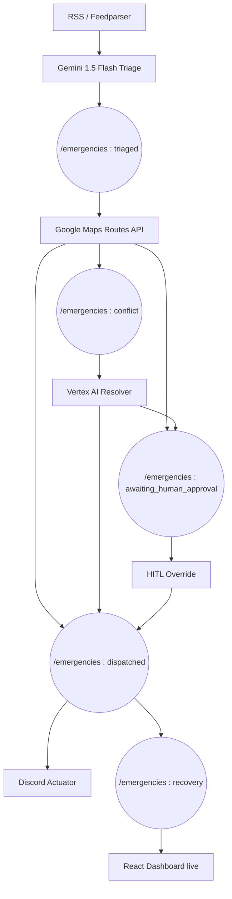

# SentinelMind: Multi-Agent Autonomous Disaster Response

> Shrink the emergency response window from hours to seconds — autonomously.

## Live Deployment
**Cloud Run URL:** [https://sentinelmind-backend-suj6h7uvga-uc.a.run.app](https://sentinelmind-backend-suj6h7uvga-uc.a.run.app)

## Mission

When a disaster strikes, every minute of delay costs lives. SentinelMind is a multi-agent AI pipeline that polls live disaster feeds, triages alerts via Gemini, routes emergency vehicles through Google Maps, resolves conflicts via Vertex AI, and dispatches real-world alerts — all asynchronously through Firestore.

## Architecture



## Project Structure

| Path | Role |
|------|------|
| `backend/orchestrator/` | Meta-orchestrator, conflict watcher, audit daemon (Role 1) |
| `scripts/feedparser_triage.py` | RSS ingestion + Gemini Flash (Role 2) |
| `scripts/discord_actuator.py` | Firestore listener → Discord webhook dispatch (Role 2) |
| `scripts/seed_firestore.py` | Stress-test mock data injector |
| `scripts/routing_daemon.py` | Vehicle matching + Google Maps + carbon math (Role 3) |
| `frontend/` | React dashboard + Firebase Hosting (Role 4) |
| `schema.json` | Universal data contract |
| `Archives/` | Roadmaps, stack docs, future phases |

## Technology Stack

- **Cloud**: GCP (Vertex AI, Secret Manager, Cloud Run)
- **Database**: Firebase Firestore (async state pipeline)
- **Frontend**: React, Tailwind CSS, Firebase Hosting
- **LLMs:** gemini-2.5-flash-lite (Multimodal context & high-speed triage)
- **Logistics**: Google Maps Routes API
- **Actuation**: Discord Webhook API (dual-channel: general + P1-only)

## State Pipeline

```
received  →  triaged  →  awaiting_dispatch  →  dispatched  →  conflict  →  recovery
                                  ↑                               ↓
                       awaiting_human_approval  ←  HITL Override  ←
```

## Setup

```bash
# 1. Install backend deps
cd backend && pip install -r requirements.txt

# 2. Copy and fill env
cp .env.template .env
# Fill: GCP_PROJECT_ID, GEMINI_API_KEY, GOOGLE_MAPS_API_KEY,
#       DISCORD_WEBHOOK_URL, GOOGLE_APPLICATION_CREDENTIALS

# 3. Seed mock resources
python scripts/seed_firestore.py

# 4. Start Backend Daemons (Unified Threading)
uvicorn main:app --host 0.0.0.0 --port 8080

# OR via Docker for Cloud Run testing
docker build -t sentinel-backend .
docker run -p 8080:8080 sentinel-backend

# 5. Start frontend
cd frontend && npm install && npm run dev
```

## Team Roles

| Role | Assignee | Domain |
|------|---------|--------|
| 1 | Aditya | System Designer & Meta-Orchestrator (The Brain) |
| 2 | Lochan | Triage Ingestion Lead (The Filter & Actuator) |
| 3 | Role 3 | Logistics & Prediction Lead (The Muscle) |
| 4 | Krishna | UI/UX & Communication Lead (The Glass) |

## Getting Started

1. Read `ROADMAP.md` for the day-by-day implementation checklist
2. Read `stack.md` for the full technical stack documentation
3. Read `Archives/Future_Steps.md` for phased development plan
4. Never commit `.env`, `service-account.json`, or webhook URLs — they are gitignored